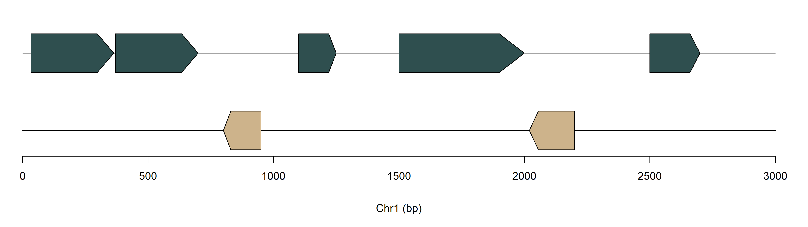
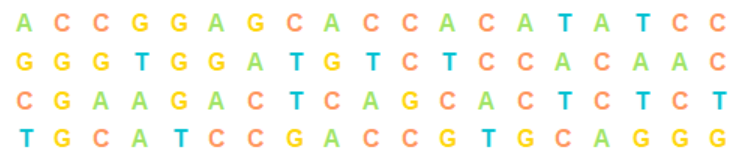
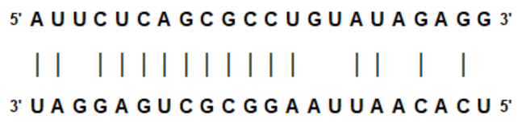
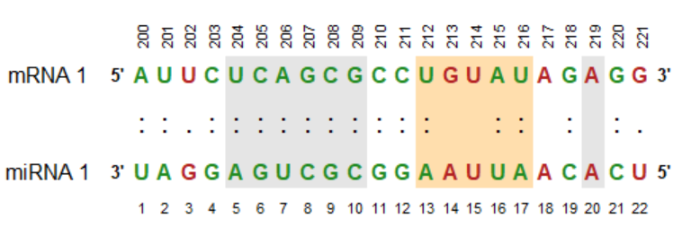

# genfuncR
A home for R functions I use myself to visualize genomic features. Will grow over time. Should serve as a starting point for own representations and compilations (multi panel plots).
<br>
<br>
Each function should do three things at its core:
-   easy to use (data.frame or string/vector as input - no fancy objects)
-   lightweight
-   no dependencies other than base R

## geneset
```r
library(grid)

# random gff file
gff <- data.frame(seqname = c("Chr1", "Chr1", "Chr2", "Chr2", "Chr2", "Chr3", "Chr3"),
                  source = rep("Genome",7),
                  feature = rep("Gene",7),
                  start = c(34, 370, 800, 1100, 1500, 2020, 2500),
                  end = c(364,700, 950, 1250, 2000, 2200, 2700),
                  score = rep(".", 7),
                  strand = c("+","+","-","+","+","-","+"),
                  frame = rep(0,7),
                  attribute = paste0("seq", seq(1,7,1)))

# example
geneset(gff)
```

<p align="center">

</p>

## dna_to_img
```r
library(grid)

# example
seq <-  "TCAGCTAGCTATCTAGCTAGCTAGCTACTACGA"
dna_to_img(seq)
```

<p align="center">

</p>

## mirnali
```r
library(grid)
library(GetoptLong)

mirna <-  "AUUCUCAGCGCCUGUAUAGAGG"
target <- "UAGGAGUCGCGGAAUUAACACU"

# basic example
mirnali(mirna, target)
```

<p align="center">

</p>

```r
# more advanced example
mirnali(mirna,
        target,
        mirna_name = "miRNA 1",
        target_name = "mRNA 1",
        alignment_type = ":",
        match_color = "forestgreen",
        mismatch_color = "firebrick",
        highlight_area = list("A" = c(5, 10), "B" = c(13, 17), "C" = c(20, 20)),
        highlight_color = list("A" = "gray90", "B" = "navajowhite", "C" = "gray90"),
        target_position_label = c(200:(199 + nchar(target))),
        target_position_label_rot = 90)
```

<p align="center">

</p>
