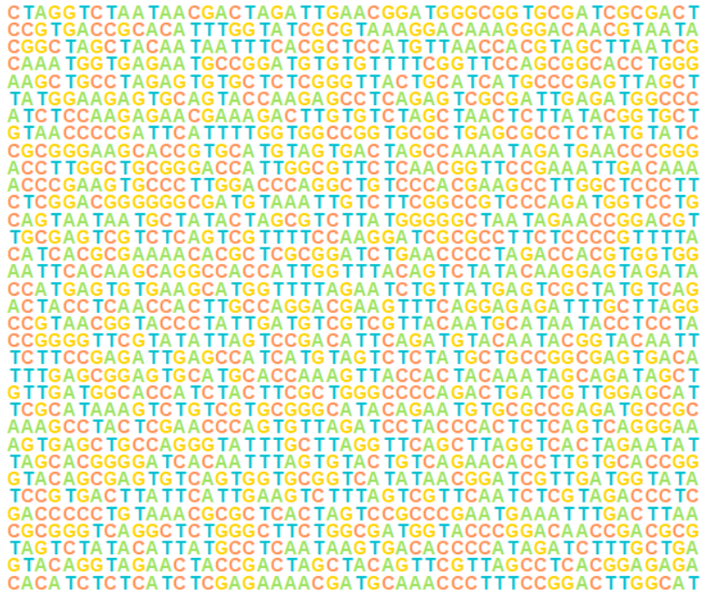

# genfuncR
A home for R functions I use myself to visualize genomic features. Will grow over time. Should serve as a starting point for own representations and compilations (multi panel plots).
<br>
<br>
Each function should do three things at its core:
-   easy to use (data.frame or string/vector as input - no fancy objects)
-   lightweight
-   no dependencies other than base R

## gene_arrow
Returns a `grid.polygon` object. Can be combined to a series of genes. 
<p align="center">

</p>

## dna_to_img
```r
library(grid)

# example
seq <-  "TCAGCTAGCTATCTAGCTAGCTAGCTACTACGA"
dna_to_img(seq)
```

<p align="center">

</p>

## mirnali
```r
library(grid)
library(GetoptLong)

mirna <-  "AUUCUCAGCGCCUGUAUAGAGG"
target <- "UAGGAGUCGCGGAAUUAACACU"

# basic example
mirnali(mirna, target)
```

<p align="center">

</p>

```r
# more advanced example
mirnali(mirna,
        target,
        mirna_name = "miRNA 1",
        target_name = "mRNA 1",
        alignment_type = ":",
        match_color = "forestgreen",
        mismatch_color = "firebrick",
        highlight_area = list("A" = c(5, 10), "B" = c(13, 17), "C" = c(20, 20)),
        highlight_color = list("A" = "gray90", "B" = "navajowhite", "C" = "gray90"),
        target_position_label = c(200:(199 + nchar(target))),
        target_position_label_rot = 90)
```

<p align="center">

</p>
